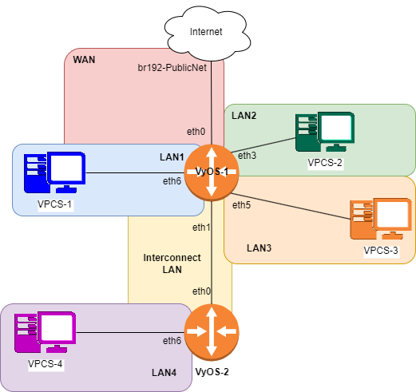

# Lab Final

## IP GRID

| Name           | Interface     | Address/Mask     |
|----------------|---------------|------------------|
|Network 1       |               | 192.168.80.0/23  |
|WAN Network     |               | 132.235.205.0/25 |
|Interconnect Network|           | 192.168.81.0/30  |
|LAN1 Network    |               | 192.168.81.32/27 |
|LAN2 Network    |               | 192.168.80.0/24  |
|LAN3 Network    |               | 192.168.81.128/25|
|LAN4 Network    |               | 192.168.81.64/26 |
|                |               |                  |
|**WAN**         |               |132.235.205.0/25  |
|VyOS-1          |eth0           |132.235.205.3/25  |
|(WAN Gateway)   |               |132.235.205.126   |
|                |               |                  |
|**Interconnect Network**|       |                  |
|VyOS-1 (Gateway)|eth1           |192.168.81.2/30   |
|VyOS-2 (Client) |eth0           |192.168.81.1/30   |
|**LAN1 Network**|               |                  |
|DHCP Pool Start |               |192.168.81.34     |
|DHCP Pool Stop  |               |192.168.81.62     |
|VyOS-1 (LAN1 Gateway)|eth6      |192.168.81.62/27  |
|                |               |                  |
|**LAN2 Network**|               |                  |
|DHCP Pool Start |               |192.168.80.3      |
|DHCP Pool Stop  |               |192.168.80.250    |
|VyOS-1 (LAN2 Gateway)|eth3      |192.168.80.254/24 |
|                |               |                  |
|**LAN3 Network**|               |                  |
|DHCP Pool Start |               |192.168.81.130    |
|DHCP Pool Stop  |               |192.168.81.254    |
|VyOS-1 (LAN3 Gateway)|eth5      |192.168.81.254/25 |
|                |               |                  |
|**LAN4 Network**|               |                  |
|DHCP Pool Start |               |192.168.81.66     |
|DHCP Pool Stop  |               |192.168.81.126    |
|VyOS-2 (LAN4 Gateway)|eth6      |192.168.81.126/26 |

## Diagram



## VyOS 1

```bash
config
set system host-name vyos-1
set interfaces ethernet eth0 address 132.235.205.3/25
set interfaces ethernet eth0 description WAN

set interfaces ethernet eth1 address 192.168.81.2/30
set interfaces ethernet eth1 description Interconnect_Network

set interfaces ethernet eth3 address 192.168.80.254/24
set interfaces ethernet eth3 description LAN2

set interfaces ethernet eth5 address 192.168.81.254/25
set interfaces ethernet eth5 description LAN3

set interfaces ethernet eth6 address 192.168.81.62/27
set interfaces ethernet eth6 description LAN1

set service dhcp-server shared-network-name LAN2_POOL subnet 192.168.80.0/24 range 0 start 192.168.80.3
set service dhcp-server shared-network-name LAN2_POOL subnet 192.168.80.0/24 range 0 stop 192.168.80.250
set service dhcp-server shared-network-name LAN2_POOL subnet 192.168.80.0/24 default-router 192.168.80.254
set service dhcp-server shared-network-name LAN2_POOL subnet 192.168.80.0/24 lease 120
set service dhcp-server shared-network-name LAN2_POOL subnet 192.168.80.0/24 name-server 132.235.9.75
set service dhcp-server shared-network-name LAN2_POOL subnet 192.168.80.0/24 name-server 132.235.200.41
commit
```

## VyOS 2

```bash
config 
set system host-name vyos-2
set interfaces ethernet eth0 address 192.168.81.1/30
set interfaces ethernet eth0 description WAN

set interfaces ethernet eth6 address 192.168.81.126/26
set interfaces ethernet eth6 description LAN4
commit
```

## Task 1 - Configuration

run this on VyOs 1 & 2

```bash
run show interfaces
```

## Task 2 - Nat

lan 2 -> VPCS 2 to ping gateway via NAT (132.235.205.126)

```bash
set nat source rule 100 outbound-interface eth0
set nat source rule 100 source address 192.168.80.0/23
set nat source rule 100 translation address masquerade
```

VPCS 2

```bash
ping 132.235.205.126
```

```bash
# VyOS 1 - LAN1 DHCP Pool
set service dhcp-server shared-network-name LAN1_POOL subnet 192.168.81.32/27 range 0 start 192.168.81.34
set service dhcp-server shared-network-name LAN1_POOL subnet 192.168.81.32/27 range 0 stop 192.168.81.62
set service dhcp-server shared-network-name LAN1_POOL subnet 192.168.81.32/27 default-router 192.168.81.62
set service dhcp-server shared-network-name LAN1_POOL subnet 192.168.81.32/27 lease 120
set service dhcp-server shared-network-name LAN1_POOL subnet 192.168.81.32/27 name-server 132.235.9.75
set service dhcp-server shared-network-name LAN1_POOL subnet 192.168.81.32/27 name-server 132.235.200.41

# VyOS 1 - LAN3 DHCP Pool
set service dhcp-server shared-network-name LAN3_POOL subnet 192.168.81.128/25 range 0 start 192.168.81.130
set service dhcp-server shared-network-name LAN3_POOL subnet 192.168.81.128/25 range 0 stop 192.168.81.254
set service dhcp-server shared-network-name LAN3_POOL subnet 192.168.81.128/25 default-router 192.168.81.254
set service dhcp-server shared-network-name LAN3_POOL subnet 192.168.81.128/25 lease 120
set service dhcp-server shared-network-name LAN3_POOL subnet 192.168.81.128/25 name-server 132.235.9.75
set service dhcp-server shared-network-name LAN3_POOL subnet 192.168.81.128/25 name-server 132.235.200.41

# VyOS 2 - LAN4 DHCP Pool
set service dhcp-server shared-network-name LAN4_POOL subnet 192.168.81.64/26 range 0 start 192.168.81.66
set service dhcp-server shared-network-name LAN4_POOL subnet 192.168.81.64/26 range 0 stop 192.168.81.126
set service dhcp-server shared-network-name LAN4_POOL subnet 192.168.81.64/26 default-router 192.168.81.126
set service dhcp-server shared-network-name LAN4_POOL subnet 192.168.81.64/26 lease 120
set service dhcp-server shared-network-name LAN4_POOL subnet 192.168.81.64/26 name-server 132.235.9.75
set service dhcp-server shared-network-name LAN4_POOL subnet 192.168.81.64/26 name-server 132.235.200.41
commit
```

## VPCS Configuration

```bash
# VPCS 1
ip 192.168.81.35/27 192.168.81.62

# VPCS 2
ip 192.168.80.10/24 192.168.80.254

# VPCS 3
ip 192.168.81.140/25 192.168.81.254

# VPCS 4
ip 192.168.81.70/26 192.168.81.126
```

## VyOS Routing Configuration

### VyOS 1

```bash
config
# Default route to WAN
set protocols static route 0.0.0.0/0 next-hop 132.235.205.126

# Static routes to LAN networks
set protocols static route 192.168.80.0/24 next-hop 192.168.81.1
set protocols static route 192.168.81.64/26 next-hop 192.168.81.1
commit
```

### VyOS 2

```bash
config
# Default route to VyOS-1
set protocols static route 0.0.0.0/0 next-hop 192.168.81.2

# Static routes to LAN networks
set protocols static route 192.168.80.0/24 next-hop 192.168.81.2
set protocols static route 192.168.81.32/27 next-hop 192.168.81.2
set protocols static route 192.168.81.128/25 next-hop 192.168.81.2
commit
```

## Verification

### VyOS 1

```bash
run show ip route
```

### VyOS 2

```bash
run show ip route
```

## Ping Tests

### VPCS 1

```bash
ping 8.8.8.8
ping 192.168.80.10
ping 192.168.81.140
ping 192.168.81.70
```

### VPCS 2

```bash
ping 8.8.8.8
ping 192.168.81.35
ping 192.168.81.140
ping 192.168.81.70
```

### VPCS 3

```bash
ping 8.8.8.8
ping 192.168.81.35
ping 192.168.80.10
ping 192.168.81.70
```

### VPCS 4

```bash
ping 8.8.8.8
ping 192.168.81.35
ping 192.168.80.10
ping 192.168.81.140
```

## Routing - Provide route tables for VyOS-1 and VyOS-2

### VyOS-1 Route Table

```bash
run show ip route
```

### VyOS-2 Route Table

```bash
run show ip route
```