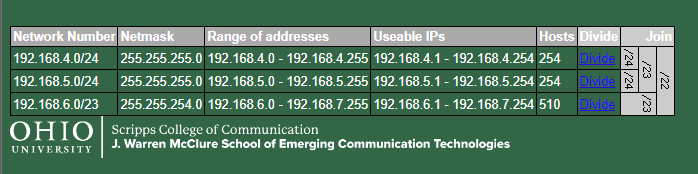
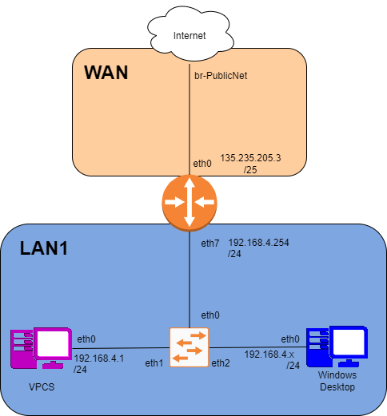

# Lab 5

## Task 1

### IP Division



### Diagrams



### IP Table

|Name | Interface | IP/Mask
|-----|---------------|------
|Student WAN Addr| |132.235.205.3/25
|Internal Network| | 192.168.4.0/22

IP Grid

|Name | Interface | IP/Mask
|-----|---------------|------
|**WAN** |
|VyOS-1 | eth0 | 132.235.205.3/25
|Gateway | br-PublicNet | 132.235.205.126
|Total IP Allocation        ||192.168.4.0/22
|**LAN1 Network**|| 192.168.4.0/24
|DHCP Pool Start|           |192.168.4.10
|DHCP Pool Stop|            |192.168.4.250
|VyOS-1 (LAN1 Gateway)|eth7 |
|VPCS | eth0 | 192.168.4.10/24 (DHCP GIVEN), 192.168.4.250/24 (RESERVED)
|Windows | eth0 | 192.168.4.11/24
|**LAN2** (Future Growth)   ||192.168.5.0/24

## Task 2

### VyOS

VyOS to internet

```bash
config
set interfaces ethernet eth0 address 132.235.205.3/25
set interfaces ethernet eth0 description WAN
set protocols static route 0.0.0.0/0 next-hop 132.235.205.126
set system name-server 132.235.9.75
set system name-server 132.235.200.41
commit
ping 8.8.8.8
ping 132.235.205.126

```

Set Up Local Network

```bash
set nat source rule 100 outbound-interface eth0
set nat source rule 100 source address 192.168.4.0/22
set nat source rule 100 translation address masquerade
commit
```

Set Up VyOS for LAN1 AKA VPCS  

```bash
config
set interfaces ethernet eth7 address 192.168.4.254/24
set interfaces ethernet eth7 description LAN1
commit
```

### VPCS

```bash
ip 192.168.4.1/24 192.168.4.254
show ip 
ping 8.8.8.8 
```

### Windows

Network settings --> IP: 192.168.4.x/24 or 255.255.255.0 WTF windows does

Maybe doing wireshark on here to see new IPS rather than static assignment

## Task 3

## Task 4

```bash
set service dhcp-server shared-network-name LAN1_POOL subnet 192.168.4.0/24 range 0 start 192.168.4.10
set service dhcp-server shared-network-name LAN1_POOL subnet 192.168.4.0/24 range 0 stop 192.168.4.250
set service dhcp-server shared-network-name LAN1_POOL subnet 192.168.4.0/24 default-router 192.168.4.254
set service dhcp-server shared-network-name LAN1_POOL subnet 192.168.4.0/24 lease 120
set service dhcp-server shared-network-name LAN1_POOL subnet 192.168.4.0/24 name-server 132.235.9.75
set service dhcp-server shared-network-name LAN1_POOL subnet 192.168.4.0/24 name-server 132.235.200.41
```

## Task 5

```bash
set service dhcp-server shared-network-name LAN1_POOL subnet 192.168.4.0/24 static-mapping PC1 mac-address 00:50:79:66:68:00
set service dhcp-server shared-network-name LAN1_POOL subnet 192.168.4.0/24 static-mapping PC1 ip-address 192.168.4.250
commit
```

## Task 6

```bash
exit
show dhcp server leases
show dhcp server statistics
```

## Task 7

huge bs

```bash
config
set interfaces ethernet eth0 address 132.235.205.3/25
set interfaces ethernet eth0 description WAN
set protocols static route 0.0.0.0/0 next-hop 132.235.205.126
set system name-server 132.235.9.75
set system name-server 132.235.200.41
commit
set nat source rule 100 outbound-interface eth0
set nat source rule 100 source address 192.168.4.0/22
set nat source rule 100 translation address masquerade
commit
set interfaces ethernet eth7 address 192.168.4.254/24
set interfaces ethernet eth7 description LAN1
commit
set service dhcp-server shared-network-name LAN1_POOL subnet 192.168.4.0/24 range 0 start 192.168.4.10
set service dhcp-server shared-network-name LAN1_POOL subnet 192.168.4.0/24 range 0 stop 192.168.4.250
set service dhcp-server shared-network-name LAN1_POOL subnet 192.168.4.0/24 default-router 192.168.4.254
set service dhcp-server shared-network-name LAN1_POOL subnet 192.168.4.0/24 lease 120
set service dhcp-server shared-network-name LAN1_POOL subnet 192.168.4.0/24 name-server 132.235.9.75
set service dhcp-server shared-network-name LAN1_POOL subnet 192.168.4.0/24 name-server 132.235.200.41
commit

# VPCS
dhcp
show ip

# VyOS
set service dhcp-server shared-network-name LAN1_POOL subnet 192.168.4.0/24 static-mapping PC1 mac-address 00:50:79:66:68:00
set service dhcp-server shared-network-name LAN1_POOL subnet 192.168.4.0/24 static-mapping PC1 ip-address 192.168.4.250
commit

# VPCS

show ip

# VyOS
exit
show dhcp server leases
show dhcp server statistics
```

## LAB WRITE UP

### Q1

itsclass@its-vyos-x# ping 8.8.8.8
PING 8.8.8.8 (8.8.8.8) 56(84) bytes of data.
64 bytes from 8.8.8.8: icmp_seq=1 ttl=54 time=20.2 ms
64 bytes from 8.8.8.8: icmp_seq=2 ttl=54 time=17.5 ms
64 bytes from 8.8.8.8: icmp_seq=3 ttl=54 time=18.4 ms
64 bytes from 8.8.8.8: icmp_seq=4 ttl=54 time=17.4 ms
64 bytes from 8.8.8.8: icmp_seq=5 ttl=54 time=18.5 ms
64 bytes from 8.8.8.8: icmp_seq=6 ttl=54 time=18.1 ms
^C
--- 8.8.8.8 ping statistics ---
6 packets transmitted, 6 received, 0% packet loss, time 5007ms
rtt min/avg/max/mdev = 17.364/18.338/20.207/0.937 ms
[edit]
itsclass@its-vyos-x# 

### Q2

PC1> ping 8.8.8.8

84 bytes from 8.8.8.8 icmp_seq=1 ttl=53 time=19.321 ms
84 bytes from 8.8.8.8 icmp_seq=2 ttl=53 time=17.560 ms
84 bytes from 8.8.8.8 icmp_seq=3 ttl=53 time=19.453 ms
84 bytes from 8.8.8.8 icmp_seq=4 ttl=53 time=19.270 ms

### Q3

REQ PACKET:
No.     Time           Source                Destination           Protocol Length Info
     77 25.433607      192.168.4.11          192.168.4.254         DHCP     350    DHCP Request  - Transaction ID 0x44827187

ACK PACKET:

No.     Time           Source                Destination           Protocol Length Info
     78 25.448636      192.168.4.254         192.168.4.11          DHCP     342    DHCP ACK      - Transaction ID 0x44827187

### Q4

exit
itsclass@its-vyos-x:~$ show dhcp server leases
IP Address    MAC address        State    Lease start          Lease expiration     Remaining    Pool       Hostname     Origin
------------  -----------------  -------  -------------------  -------------------  -----------  ---------  -----------  --------
192.168.4.10  00:50:79:66:68:00  active   2024/09/26 16:05:10  2024/09/26 16:07:10  0:01:27      LAN1_POOL  PC1          local
192.168.4.11  0c:53:25:6d:00:00  active   2024/09/26 16:05:17  2024/09/26 16:07:17  0:01:34      LAN1_POOL  ITS-Win11-1  local
itsclass@its-vyos-x:~$ show dhcp server statistics
Pool       Size    Leases    Available    Usage
---------  ------  --------  -----------  -------
LAN1_POOL  241     2         239          1%
itsclass@its-vyos-x:~$ 

### Q5

see IP TABLE
