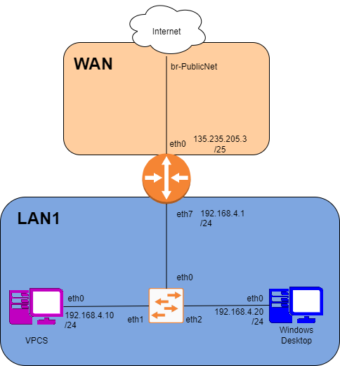

# Lab 5

## Task 1

### IP Division


### Diagrams



### IP Table

|Name | Interface | IP/Mask
|-----|---------------|------
|Student WAN Addr| |132.235.205.3/25
|Internal Network| | 192.168.4.0/22

IP Grid

|Name | Interface | IP/Mask
|-----|---------------|------
|**WAN** |
|VyOS-1 | eth0 | 132.235.205.3/25
|Gateway | br-PublicNet | 132.235.205.126
|Total IP Allocation        ||192.168.4.0/22
|**LAN1 Network**||192.168.4.0/24
|DHCP Pool Start|           |
|DHCP Pool Stop|            |
|VyOS-1 (LAN1 Gateway)|eth7 |
|VPCS | eth0 | 192.168.4.1/24
|**LAN2** (Future Growth)   ||192.168.5.0/24

## Task 2

### VyOS

VyOS to internet

```bash
config
set interfaces ethernet eth0 address 132.235.205.3/25
set interfaces ethernet eth0 description WAN
set protocols static route 0.0.0.0/0 next-hop 132.235.205.126
set system name-server 132.235.9.75
set system name-server 132.235.200.41
commit
ping 8.8.8.8
ping 132.235.205.126

```

Set Up Local Network

```bash
set nat source rule 100 outbound-interface eth0
set nat source rule 100 source address 192.168.4.0/22
set nat source rule 100 translation address masquerade
commit
```

Set Up VyOS for LAN1 AKA VPCS  

```bash
config
set interfaces ethernet eth7 address 192.168.4.254/24
commit
```

### VPCS

```bash
ip 192.168.4.1/24 192.168.4.254
show ip 
ping 8.8.8.8 
```

### Windows

Network settings --> IP: 192.168.4.x/24 or 255.255.255.0 WTF windows does

## Task 3

## Task 4

```bash
set service dhcp-server shared-network-name <LAN1_POOL_NAME> subnet <LAN1_NET_NUM>/<LAN1_MASK> range 0 start <LAN1_DHCPPOOL_START>
set service dhcp-server shared-network-name <LAN1_POOL_NAME> subnet <LAN1_NET_NUM>/<LAN1_MASK> range 0 stop <LAN1_DHCPPOOL_STOP>
set service dhcp-server shared-network-name <LAN1_POOL_NAME> subnet <LAN1_NET_NUM>/<LAN1_MASK> default-router <LAN1_GATEWAY>
set service dhcp-server shared-network-name <LAN1_POOL_NAME> subnet <LAN1_NET_NUM>/<LAN1_MASK> lease 120
set service dhcp-server shared-network-name <LAN1_POOL_NAME> subnet <LAN1_NET_NUM>/<LAN1_MASK> name-server 132.235.9.75
set service dhcp-server shared-network-name <LAN1_POOL_NAME> subnet <LAN1_NET_NUM>/<LAN1_MASK> name-server 132.235.200.41
```

## Task 5

```bash
set service dhcp-server shared-network-name <LAN1_POOL_NAME> subnet <LAN1_NET_NUM>/<LAN1_MASK> static-mapping <NAME_OF_DEVICE> mac-address <VPCS_MAC_ADDRESS>
set service dhcp-server shared-network-name <LAN1_POOL_NAME> subnet <LAN1_NET_NUM>/<LAN1_MASK> static-mapping <NAME_OF_DEVICE> ip-address <LAST_IP_IN_DHCP_POOL>
commit
```

## Task 6

## Task 7
