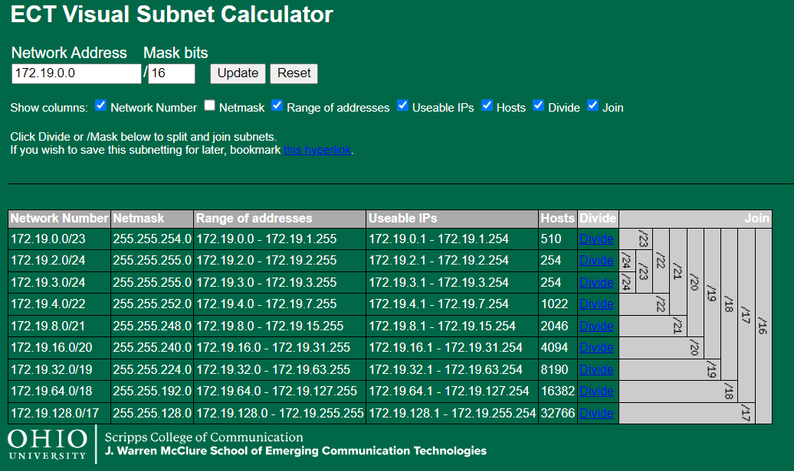
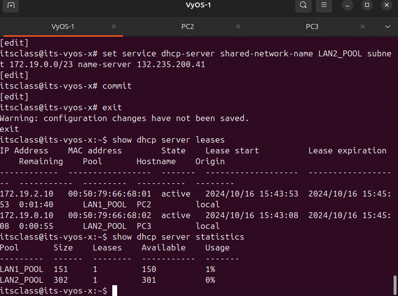
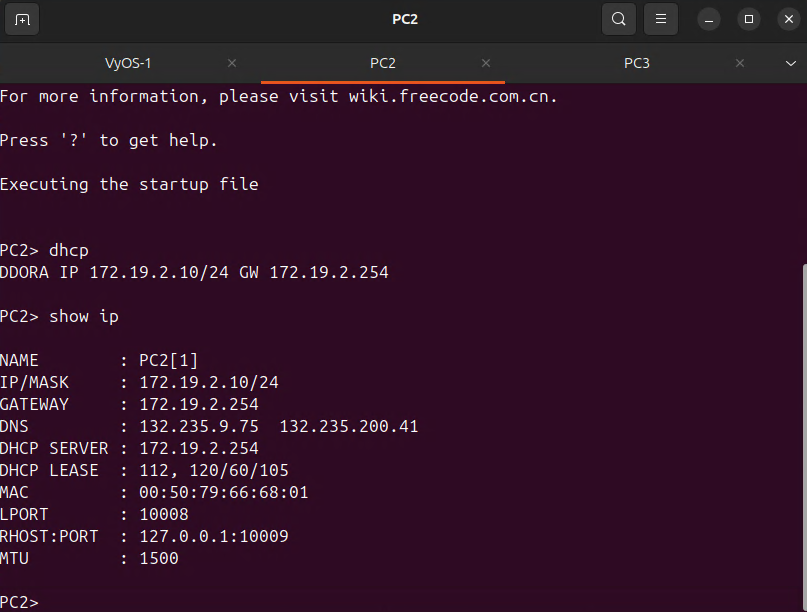
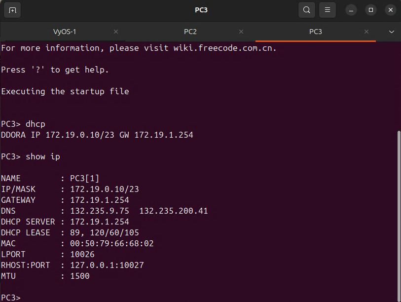

# Lab 6 - Izaak Wolfgang White

NAT & NMAP LAB

## My Network



## IP Grid - Task 1

| Name           | Interface     | Address/Mask     |
|----------------|---------------|------------------|
|WAN Network     | eth0          | 132.235.205.0/25 |
|LAN1 Network    | eth6          | 172.19.2.0/24    |
|LAN2 Network    | eth7          | 172.19.0.0/23    |
|                |               |                  |
|**WAN**         |               |                  |
|VyOS-1          | eth0          |132.235.205.3/25  |
|(WAN Gateway)   |               |132.235.205.126   |
|                |               |                  |
|**LAN1 Network**|               |                  |
|DHCP Pool Start |               |172.19.2.10       |
|DHCP Pool Stop        |         |172.19.2.160      |
|VyOS-1 (LAN1 Gateway) |eth6 - e0     |172.19.2.254      |
||||
|**LAN2 Network**      |||
|DHCP Pool Start       ||172.19.0.10|
|DHCP Pool Stop        ||172.19.1.55|
|VyOS-2 (LAN2 Gateway) |eth7 - e0|172.19.1.254|

## Task 2  - Recipe

VyOS

```bash
config
set interfaces ethernet eth0 address 132.235.205.3/25
set interfaces ethernet eth0 description WAN
set protocols static route 0.0.0.0/0 next-hop 132.235.205.126
set system name-server 132.235.9.75
set system name-server 132.235.200.41
set nat source rule 100 outbound-interface eth0
set nat source rule 100 source address 172.19.0.0/16
set nat source rule 100 translation address masquerade
set interfaces ethernet eth6 address 172.19.2.254/24
set interfaces ethernet eth6 description LAN1
set interfaces ethernet eth7 address 172.19.1.254/23
set interfaces ethernet eth7 description LAN2
set service dhcp-server shared-network-name LAN1_POOL subnet 172.19.2.0/24 range 0 start 172.19.2.10
set service dhcp-server shared-network-name LAN1_POOL subnet 172.19.2.0/24 range 0 stop 172.19.2.160
set service dhcp-server shared-network-name LAN1_POOL subnet 172.19.2.0/24 default-router 172.19.2.254
set service dhcp-server shared-network-name LAN1_POOL subnet 172.19.2.0/24 lease 120
set service dhcp-server shared-network-name LAN1_POOL subnet 172.19.2.0/24 name-server 132.235.9.75
set service dhcp-server shared-network-name LAN1_POOL subnet 172.19.2.0/24 name-server 132.235.200.41
set service dhcp-server shared-network-name LAN2_POOL subnet 172.19.0.0/23 range 0 start 172.19.0.10
set service dhcp-server shared-network-name LAN2_POOL subnet 172.19.0.0/23 range 0 stop 172.19.1.55
set service dhcp-server shared-network-name LAN2_POOL subnet 172.19.0.0/23 default-router 172.19.1.254
set service dhcp-server shared-network-name LAN2_POOL subnet 172.19.0.0/23 lease 120
set service dhcp-server shared-network-name LAN2_POOL subnet 172.19.0.0/23 name-server 132.235.9.75
set service dhcp-server shared-network-name LAN2_POOL subnet 172.19.0.0/23 name-server 132.235.200.41
commit
```

To get DHCP confirmation for VPCS's

```bash
dhcp
show ip
```

VyOS

```bash
exit
show dhcp server leases
show dhcp server statistics
```

Results:
---





END OF PRE LAB
===

## Task 3

VyOS Script with 0 nat

```bash
config
set interfaces ethernet eth0 address 132.235.205.3/25
set interfaces ethernet eth0 description WAN
set protocols static route 0.0.0.0/0 next-hop 132.235.205.126
set system name-server 132.235.9.75
set system name-server 132.235.200.41
set interfaces ethernet eth6 address 172.19.2.254/24
set interfaces ethernet eth6 description LAN1
set interfaces ethernet eth7 address 172.19.1.254/23
set interfaces ethernet eth7 description LAN2
set service dhcp-server shared-network-name LAN1_POOL subnet 172.19.2.0/24 range 0 start 172.19.2.10
set service dhcp-server shared-network-name LAN1_POOL subnet 172.19.2.0/24 range 0 stop 172.19.2.160
set service dhcp-server shared-network-name LAN1_POOL subnet 172.19.2.0/24 default-router 172.19.2.254
set service dhcp-server shared-network-name LAN1_POOL subnet 172.19.2.0/24 lease 120
set service dhcp-server shared-network-name LAN1_POOL subnet 172.19.2.0/24 name-server 132.235.9.75
set service dhcp-server shared-network-name LAN1_POOL subnet 172.19.2.0/24 name-server 132.235.200.41
set service dhcp-server shared-network-name LAN2_POOL subnet 172.19.0.0/23 range 0 start 172.19.0.10
set service dhcp-server shared-network-name LAN2_POOL subnet 172.19.0.0/23 range 0 stop 172.19.1.55
set service dhcp-server shared-network-name LAN2_POOL subnet 172.19.0.0/23 default-router 172.19.1.254
set service dhcp-server shared-network-name LAN2_POOL subnet 172.19.0.0/23 lease 120
set service dhcp-server shared-network-name LAN2_POOL subnet 172.19.0.0/23 name-server 132.235.9.75
set service dhcp-server shared-network-name LAN2_POOL subnet 172.19.0.0/23 name-server 132.235.200.41
commit
```

### wire capture from VyOS to WAN - Wireshark Results -- Ping Out from VPCS to 8.8.8.8 will fail

```txt
No.     Time           Source                Destination           Protocol Length Info
      6 13.171950      172.19.2.10           8.8.8.8               ICMP     98     Echo (ping) request  id=0xf22d, seq=2/512, ttl=63 (no response found!)

Frame 6: 98 bytes on wire (784 bits), 98 bytes captured (784 bits) on interface -, id 0
Ethernet II, Src: 0c:28:e7:52:00:00 (0c:28:e7:52:00:00), Dst: VMware_83:6f:6e (00:50:56:83:6f:6e)
Internet Protocol Version 4, Src: 172.19.2.10, Dst: 8.8.8.8
Internet Control Message Protocol

No.     Time           Source                Destination           Protocol Length Info
      9 15.172584      172.19.2.10           8.8.8.8               ICMP     98     Echo (ping) request  id=0xf42d, seq=3/768, ttl=63 (no response found!)

Frame 9: 98 bytes on wire (784 bits), 98 bytes captured (784 bits) on interface -, id 0
Ethernet II, Src: 0c:28:e7:52:00:00 (0c:28:e7:52:00:00), Dst: VMware_83:6f:6e (00:50:56:83:6f:6e)
Internet Protocol Version 4, Src: 172.19.2.10, Dst: 8.8.8.8
Internet Control Message Protocol
```

### Then do this --- I ran into some issues so I just re did my VyOS with task 2 script

```bash
set nat source rule 100 outbound-interface eth0
set nat source rule 100 source address 172.19.0.0/16
set nat source rule 100 translation address masquerade
```

### Then Sniff again between VyOS and WAN

```txt
No.     Time           Source                Destination           Protocol Length Info
      3 5.882962       8.8.8.8               132.235.205.36        ICMP     98     Echo (ping) reply    id=0xc12f, seq=1/256, ttl=54

Frame 3: 98 bytes on wire (784 bits), 98 bytes captured (784 bits) on interface -, id 0
Ethernet II, Src: VMware_83:6f:6e (00:50:56:83:6f:6e), Dst: 0c:d9:ff:6f:00:00 (0c:d9:ff:6f:00:00)
Internet Protocol Version 4, Src: 8.8.8.8, Dst: 132.235.205.36
Internet Control Message Protocol

No.     Time           Source                Destination           Protocol Length Info
     10 43.544270      132.235.205.3         8.8.8.8               ICMP     98     Echo (ping) request  id=0xe72f, seq=1/256, ttl=63 (reply in 11)

Frame 10: 98 bytes on wire (784 bits), 98 bytes captured (784 bits) on interface -, id 0
Ethernet II, Src: 0c:28:e7:52:00:00 (0c:28:e7:52:00:00), Dst: VMware_83:6f:6e (00:50:56:83:6f:6e)
Internet Protocol Version 4, Src: 132.235.205.3, Dst: 8.8.8.8
Internet Control Message Protocol
```

## Task 4 

Make Network in GNS3

## Task 5

in VyOS

```bash
set nat destination rule 10 description 'Port Forward: Public HTTP (8080) to Ubuntu-CLI-1 HTTP (80)'
set nat destination rule 10 destination port 8080
set nat destination rule 10 inbound-interface eth0
set nat destination rule 10 protocol tcp 
set nat destination rule 10 translation address 172.19.2.11
set nat destination rule 10 translation port 80
```

Also VyOS

```bash
show nat source rules
show nat destination rules
show nat source statistics
show nat destination statistics
show nat source translations
show nat destination translations
```

## Task 6

ZenMap mhsp.ohio.edu or whateves

## Task 7

|Name |Interface| Address/Mask|
|---  |--- |--------|
|WAN Network |eth0|132.235.205.0/25
|LAN1 Network |eth6|172.19.2.0/24
|LAN2 Network |eth7|172.19.0.0/23
||
|**WAN**
|VyOS-1|eth0|132.235.205.3/25
|(WAN Gateway) ||132.235.205.126
||
|**LAN1 Network**
|DHCP Pool Start ||172.19.2.10
|VPCS|e0|172.19.2.10|
|Ubuntu-CLI-1|e1|172.19.2.11|
|DHCP Pool Stop ||172.19.2.160
|VyOS-1 (LAN1 Gateway) |eth6| 172.19.2.254
||
|**LAN2 Network**
|DHCP Pool Start ||172.19.0.10
|VPCS|e0|172.19.0.10
|Win-Desktop-1|e1|172.19.0.11|
|DHCP Pool Stop ||172.19.1.55|
|VyOS-2 (LAN2 Gateway) |eth7|172.19.1.254
||
|gHost IP||10.101.40.3|
