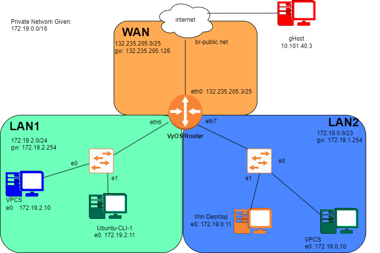

# Lab 6 - Izaak Wolfgang White

NAT & NMAP LAB

## My Network


## IP Grid - Task 1

| Name           | Interface     | Address/Mask     |
|----------------|---------------|------------------|
|WAN Network     | eth0          | 132.235.205.0/25 |
|LAN1 Network    | eth6          | 172.19.2.0/24    |
|LAN2 Network    | eth7          | 172.19.0.0/23    |
|                |               |                  |
|**WAN**         |               |                  |
|VyOS-1          | eth0          |132.235.205.3/25  |
|(WAN Gateway)   |               |132.235.205.126   |
|                |               |                  |
|**LAN1 Network**|               |                  |
|DHCP Pool Start |               |172.19.2.10       |
|DHCP Pool Stop        |         |172.19.2.160      |
|VyOS-1 (LAN1 Gateway) |eth6 - e0     |172.19.2.254      |
||||
|**LAN2 Network**      |||
|DHCP Pool Start       ||172.19.0.10|
|DHCP Pool Stop        ||172.19.1.55|
|VyOS-2 (LAN2 Gateway) |eth7 - e0|172.19.1.254|

## Task 2  - Recipe

VyOS

```bash
config
set interfaces ethernet eth0 address 132.235.205.3/25
set interfaces ethernet eth0 description WAN
set protocols static route 0.0.0.0/0 next-hop 132.235.205.126
set system name-server 132.235.9.75
set system name-server 132.235.200.41
set nat source rule 100 outbound-interface eth0
set nat source rule 100 source address 172.19.0.0/16
set nat source rule 100 translation address masquerade
set interfaces ethernet eth6 address 172.19.2.254/24
set interfaces ethernet eth6 description LAN1
set interfaces ethernet eth7 address 172.19.1.254/23
set interfaces ethernet eth7 description LAN2
set service dhcp-server shared-network-name LAN1_POOL subnet 172.19.2.0/24 range 0 start 172.19.2.10
set service dhcp-server shared-network-name LAN1_POOL subnet 172.19.2.0/24 range 0 stop 172.19.2.160
set service dhcp-server shared-network-name LAN1_POOL subnet 172.19.2.0/24 default-router 172.19.2.254
set service dhcp-server shared-network-name LAN1_POOL subnet 172.19.2.0/24 lease 120
set service dhcp-server shared-network-name LAN1_POOL subnet 172.19.2.0/24 name-server 132.235.9.75
set service dhcp-server shared-network-name LAN1_POOL subnet 172.19.2.0/24 name-server 132.235.200.41
set service dhcp-server shared-network-name LAN2_POOL subnet 172.19.0.0/23 range 0 start 172.19.0.10
set service dhcp-server shared-network-name LAN2_POOL subnet 172.19.0.0/23 range 0 stop 172.19.1.55
set service dhcp-server shared-network-name LAN2_POOL subnet 172.19.0.0/23 default-router 172.19.1.254
set service dhcp-server shared-network-name LAN2_POOL subnet 172.19.0.0/23 lease 120
set service dhcp-server shared-network-name LAN2_POOL subnet 172.19.0.0/23 name-server 132.235.9.75
set service dhcp-server shared-network-name LAN2_POOL subnet 172.19.0.0/23 name-server 132.235.200.41
commit
```

To get DHCP confirmation for VPCS's

```bash
dhcp
show ip
```

VyOS

```bash
exit
show dhcp server leases
show dhcp server statistics
```

Results:
---


END OF PRE LAB
===

## Task 3

VyOS Script with 0 nat

```bash
config
set interfaces ethernet eth0 address 132.235.205.3/25
set interfaces ethernet eth0 description WAN
set protocols static route 0.0.0.0/0 next-hop 132.235.205.126
set system name-server 132.235.9.75
set system name-server 132.235.200.41
set interfaces ethernet eth6 address 172.19.2.254/24
set interfaces ethernet eth6 description LAN1
set interfaces ethernet eth7 address 172.19.1.254/23
set interfaces ethernet eth7 description LAN2
set service dhcp-server shared-network-name LAN1_POOL subnet 172.19.2.0/24 range 0 start 172.19.2.10
set service dhcp-server shared-network-name LAN1_POOL subnet 172.19.2.0/24 range 0 stop 172.19.2.160
set service dhcp-server shared-network-name LAN1_POOL subnet 172.19.2.0/24 default-router 172.19.2.254
set service dhcp-server shared-network-name LAN1_POOL subnet 172.19.2.0/24 lease 120
set service dhcp-server shared-network-name LAN1_POOL subnet 172.19.2.0/24 name-server 132.235.9.75
set service dhcp-server shared-network-name LAN1_POOL subnet 172.19.2.0/24 name-server 132.235.200.41
set service dhcp-server shared-network-name LAN2_POOL subnet 172.19.0.0/23 range 0 start 172.19.0.10
set service dhcp-server shared-network-name LAN2_POOL subnet 172.19.0.0/23 range 0 stop 172.19.1.55
set service dhcp-server shared-network-name LAN2_POOL subnet 172.19.0.0/23 default-router 172.19.1.254
set service dhcp-server shared-network-name LAN2_POOL subnet 172.19.0.0/23 lease 120
set service dhcp-server shared-network-name LAN2_POOL subnet 172.19.0.0/23 name-server 132.235.9.75
set service dhcp-server shared-network-name LAN2_POOL subnet 172.19.0.0/23 name-server 132.235.200.41
commit
```

### wire capture from VyOS to WAN - Wireshark Results -- Ping Out from VPCS to 8.8.8.8 will fail

```txt
No.     Time           Source                Destination           Protocol Length Info
      6 13.171950      172.19.2.10           8.8.8.8               ICMP     98     Echo (ping) request  id=0xf22d, seq=2/512, ttl=63 (no response found!)

Frame 6: 98 bytes on wire (784 bits), 98 bytes captured (784 bits) on interface -, id 0
Ethernet II, Src: 0c:28:e7:52:00:00 (0c:28:e7:52:00:00), Dst: VMware_83:6f:6e (00:50:56:83:6f:6e)
Internet Protocol Version 4, Src: 172.19.2.10, Dst: 8.8.8.8
Internet Control Message Protocol

No.     Time           Source                Destination           Protocol Length Info
      9 15.172584      172.19.2.10           8.8.8.8               ICMP     98     Echo (ping) request  id=0xf42d, seq=3/768, ttl=63 (no response found!)

Frame 9: 98 bytes on wire (784 bits), 98 bytes captured (784 bits) on interface -, id 0
Ethernet II, Src: 0c:28:e7:52:00:00 (0c:28:e7:52:00:00), Dst: VMware_83:6f:6e (00:50:56:83:6f:6e)
Internet Protocol Version 4, Src: 172.19.2.10, Dst: 8.8.8.8
Internet Control Message Protocol
```

### Then do this --- I ran into some issues so I just re did my VyOS with task 2 script

```bash
set nat source rule 100 outbound-interface eth0
set nat source rule 100 source address 172.19.0.0/16
set nat source rule 100 translation address masquerade
```

### Then Sniff again between VyOS and WAN

```txt
No.     Time           Source                Destination           Protocol Length Info
      3 5.882962       8.8.8.8               132.235.205.36        ICMP     98     Echo (ping) reply    id=0xc12f, seq=1/256, ttl=54

Frame 3: 98 bytes on wire (784 bits), 98 bytes captured (784 bits) on interface -, id 0
Ethernet II, Src: VMware_83:6f:6e (00:50:56:83:6f:6e), Dst: 0c:d9:ff:6f:00:00 (0c:d9:ff:6f:00:00)
Internet Protocol Version 4, Src: 8.8.8.8, Dst: 132.235.205.36
Internet Control Message Protocol

No.     Time           Source                Destination           Protocol Length Info
     10 43.544270      132.235.205.3         8.8.8.8               ICMP     98     Echo (ping) request  id=0xe72f, seq=1/256, ttl=63 (reply in 11)

Frame 10: 98 bytes on wire (784 bits), 98 bytes captured (784 bits) on interface -, id 0
Ethernet II, Src: 0c:28:e7:52:00:00 (0c:28:e7:52:00:00), Dst: VMware_83:6f:6e (00:50:56:83:6f:6e)
Internet Protocol Version 4, Src: 132.235.205.3, Dst: 8.8.8.8
Internet Control Message Protocol
```

## Task 4 

Make Network in GNS3

## Task 5

in VyOS

```bash
set nat destination rule 10 description 'Port Forward: Public HTTP (8080) to Ubuntu-CLI-1 HTTP (80)'
set nat destination rule 10 destination port 8080
set nat destination rule 10 inbound-interface eth0
set nat destination rule 10 protocol tcp 
set nat destination rule 10 translation address 172.19.2.11
set nat destination rule 10 translation port 80
```

Also VyOS

```bash
show nat source rules
show nat destination rules
show nat source statistics
show nat destination statistics
show nat source translations
show nat destination translations
```

## Task 6

ZenMap mhsp.ohio.edu or whateves

## Task 7

|Name |Interface| Address/Mask|
|---  |--- |--------|
|WAN Network |eth0|132.235.205.0/25
|LAN1 Network |eth6|172.19.2.0/24
|LAN2 Network |eth7|172.19.0.0/23
||
|**WAN**
|VyOS-1|eth0|132.235.205.3/25
|(WAN Gateway) ||132.235.205.126
||
|**LAN1 Network**
|DHCP Pool Start ||172.19.2.10
|VPCS|e0|172.19.2.10|
|Ubuntu-CLI-1|e1|172.19.2.11|
|DHCP Pool Stop ||172.19.2.160
|VyOS-1 (LAN1 Gateway) |eth6| 172.19.2.254
||
|**LAN2 Network**
|DHCP Pool Start ||172.19.0.10
|VPCS|e0|172.19.0.10
|Win-Desktop-1|e1|172.19.0.11|
|DHCP Pool Stop ||172.19.1.55|
|VyOS-2 (LAN2 Gateway) |eth7|172.19.1.254
||
|gHost IP||10.101.40.3|



## Lab Report

```txt
Q1
PC1> ping 172.19.2.254

84 bytes from 172.19.2.254 icmp_seq=1 ttl=64 time=1.161 ms
84 bytes from 172.19.2.254 icmp_seq=2 ttl=64 time=0.890 ms
84 bytes from 172.19.2.254 icmp_seq=3 ttl=64 time=1.337 ms
84 bytes from 172.19.2.254 icmp_seq=4 ttl=64 time=1.904 ms
^C
PC1> 

Q2
No.     Time           Source                Destination           Protocol Length Info

      6 13.171950      172.19.2.10           8.8.8.8               ICMP     98     Echo (ping) request  id=0xf22d, seq=2/512, ttl=63 (no response found!)
No.     Time           Source                Destination           Protocol Length Info

      9 15.172584      172.19.2.10           8.8.8.8               ICMP     98     Echo (ping) request  id=0xf42d, seq=3/768, ttl=63 (no response found!)


Q3

No.     Time           Source                Destination           Protocol Length Info

      6 13.171950      172.19.2.10           8.8.8.8               ICMP     98     Echo (ping) request  id=0xf22d, seq=2/512, ttl=63 (no response found!)

No.     Time           Source                Destination           Protocol Length Info

      9 15.172584      172.19.2.10           8.8.8.8               ICMP     98     Echo (ping) request  id=0xf42d, seq=3/768, ttl=63 (no response found!)
---NAT
No.     Time           Source                Destination           Protocol Length Info
      3 5.882962       8.8.8.8               132.235.205.36        ICMP     98     Echo (ping) reply    id=0xc12f, seq=1/256, ttl=54

No.     Time           Source                Destination           Protocol Length Info
     10 43.544270      132.235.205.3         8.8.8.8               ICMP     98     Echo (ping) request  id=0xe72f, seq=1/256, ttl=63 (reply in 11)


Q4
itsclass@its-vyos-x:~$ show nat source rules
Rule    Source         Destination    Proto    Out-Int    Translation
------  -------------  -------------  -------  ---------  -------------
100     172.19.0.0/16  0.0.0.0/0      IP       any        masquerade
        sport any      dport any


itsclass@its-vyos-x:~$ show nat destination rules
Rule    Source     Destination    Proto    In-Int    Translation
------  ---------  -------------  -------  --------  -------------
10      0.0.0.0/0  0.0.0.0/0      any      any       172.19.2.11
        sport any  dport 8080                        port 80


itsclass@its-vyos-x:~$ show nat source statistics
Rule    Packets    Bytes    Interface
------  ---------  -------  -----------
100     68         7637     any


itsclass@its-vyos-x:~$ show nat destination statistics
Rule    Packets    Bytes    Interface
------  ---------  -------  -----------
10      0          0        any


itsclass@its-vyos-x:~$ show nat source translations
Pre-NAT            Post-NAT             Proto    Timeout    Mark    Zone
Pre-NAT            Post-NAT             Proto    Timeout    Mark    Zone
-----------------  -------------------  -------  ---------  ------  ------
172.19.0.11:49752  132.235.205.3:49752  tcp      20         0
172.19.0.11:49785  132.235.205.3:49785  tcp      81         0
172.19.0.11:49781  132.235.205.3:49781  tcp      431950     0
172.19.0.11:54100  132.235.205.3:54100  udp      139        0
172.19.0.11:49775  132.235.205.3:49775  tcp      431938     0
172.19.2.11        132.235.205.3        icmp     29         0
172.19.0.11:49769  132.235.205.3:49769  tcp      431900     0
172.19.0.11:49755  132.235.205.3:49755  tcp      49         0
172.19.0.11:49761  132.235.205.3:49761  tcp      49         0
172.19.0.11:49759  132.235.205.3:49759  tcp      431909     0
172.19.0.11:49758  132.235.205.3:49758  tcp      49         0
172.19.0.11:49762  132.235.205.3:49762  tcp      49         0
172.19.0.11:49779  132.235.205.3:49779  tcp      81         0
172.19.0.11:49782  132.235.205.3:49782  tcp      81         0
172.19.0.11:49756  132.235.205.3:49756  tcp      49         0
172.19.0.11:49777  132.235.205.3:49777  tcp      62         0
172.19.0.11:49749  132.235.205.3:49749  tcp      431980     0
172.19.0.11:49748  132.235.205.3:49748  tcp      49         0
172.19.0.11:49751  132.235.205.3:49751  tcp      20         0
172.19.0.11:53293  132.235.205.3:53293  udp      155        0
172.19.0.11:49747  132.235.205.3:49747  tcp      20         0


show nat destination translations
Pre-NAT             Post-NAT        Proto    Timeout    Mark    Zone
------------------  --------------  -------  ---------  ------  ------
132.235.205.3:8080  172.19.2.11:80  tcp      104        0
8.8.8.8             8.8.8.8         icmp     29         0
Q5:


Starting Nmap 7.93 ( https://nmap.org ) at 2024-10-17 16:19 Eastern Daylight Time
Nmap scan report for mesp.ohio.edu (132.235.160.21)
Host is up (0.012s latency).
Not shown: 96 closed tcp ports (reset)
PORT     STATE SERVICE
22/tcp   open  ssh
80/tcp   open  http
443/tcp  open  https
8080/tcp open  http-proxy


Nmap done: 1 IP address (1 host up) scanned in 0.41 seconds
Q6:

VyOS


config
set interfaces ethernet eth0 address 132.235.205.3/25
set interfaces ethernet eth0 description WAN
set protocols static route 0.0.0.0/0 next-hop 132.235.205.126
set system name-server 132.235.9.75
set system name-server 132.235.200.41
set nat source rule 100 outbound-interface eth0
set nat source rule 100 source address 172.19.0.0/16
set nat source rule 100 translation address masquerade
set interfaces ethernet eth6 address 172.19.2.254/24
set interfaces ethernet eth6 description LAN1
set interfaces ethernet eth7 address 172.19.1.254/23
set interfaces ethernet eth7 description LAN2
set service dhcp-server shared-network-name LAN1_POOL subnet 172.19.2.0/24 range 0 start 172.19.2.10
set service dhcp-server shared-network-name LAN1_POOL subnet 172.19.2.0/24 range 0 stop 172.19.2.160
set service dhcp-server shared-network-name LAN1_POOL subnet 172.19.2.0/24 default-router 172.19.2.254
set service dhcp-server shared-network-name LAN1_POOL subnet 172.19.2.0/24 lease 120
set service dhcp-server shared-network-name LAN1_POOL subnet 172.19.2.0/24 name-server 132.235.9.75
set service dhcp-server shared-network-name LAN1_POOL subnet 172.19.2.0/24 name-server 132.235.200.41
set service dhcp-server shared-network-name LAN2_POOL subnet 172.19.0.0/23 range 0 start 172.19.0.10
set service dhcp-server shared-network-name LAN2_POOL subnet 172.19.0.0/23 range 0 stop 172.19.1.55
set service dhcp-server shared-network-name LAN2_POOL subnet 172.19.0.0/23 default-router 172.19.1.254
set service dhcp-server shared-network-name LAN2_POOL subnet 172.19.0.0/23 lease 120
set service dhcp-server shared-network-name LAN2_POOL subnet 172.19.0.0/23 name-server 132.235.9.75
set service dhcp-server shared-network-name LAN2_POOL subnet 172.19.0.0/23 name-server 132.235.200.41
commit


To get DHCP confirmation for VPCS's


dhcp
show ip


VyOS


exit
show dhcp server leases
show dhcp server statistics


VyOS Script with 0 nat


config
set interfaces ethernet eth0 address 132.235.205.3/25
set interfaces ethernet eth0 description WAN
set protocols static route 0.0.0.0/0 next-hop 132.235.205.126
set system name-server 132.235.9.75
set system name-server 132.235.200.41
set interfaces ethernet eth6 address 172.19.2.254/24
set interfaces ethernet eth6 description LAN1
set interfaces ethernet eth7 address 172.19.1.254/23
set interfaces ethernet eth7 description LAN2
set service dhcp-server shared-network-name LAN1_POOL subnet 172.19.2.0/24 range 0 start 172.19.2.10
set service dhcp-server shared-network-name LAN1_POOL subnet 172.19.2.0/24 range 0 stop 172.19.2.160
set service dhcp-server shared-network-name LAN1_POOL subnet 172.19.2.0/24 default-router 172.19.2.254
set service dhcp-server shared-network-name LAN1_POOL subnet 172.19.2.0/24 lease 120
set service dhcp-server shared-network-name LAN1_POOL subnet 172.19.2.0/24 name-server 132.235.9.75
set service dhcp-server shared-network-name LAN1_POOL subnet 172.19.2.0/24 name-server 132.235.200.41
set service dhcp-server shared-network-name LAN2_POOL subnet 172.19.0.0/23 range 0 start 172.19.0.10
set service dhcp-server shared-network-name LAN2_POOL subnet 172.19.0.0/23 range 0 stop 172.19.1.55
set service dhcp-server shared-network-name LAN2_POOL subnet 172.19.0.0/23 default-router 172.19.1.254
set service dhcp-server shared-network-name LAN2_POOL subnet 172.19.0.0/23 lease 120
set service dhcp-server shared-network-name LAN2_POOL subnet 172.19.0.0/23 name-server 132.235.9.75
set service dhcp-server shared-network-name LAN2_POOL subnet 172.19.0.0/23 name-server 132.235.200.41
commit


VyOs Nat


set nat source rule 100 outbound-interface eth0
set nat source rule 100 source address 172.19.0.0/16
set nat source rule 100 translation address masquerade


 


in VyOS


set nat destination rule 10 description 'Port Forward: Public HTTP (8080) to Ubuntu-CLI-1 HTTP (80)'
set nat destination rule 10 destination port 8080
set nat destination rule 10 inbound-interface eth0
set nat destination rule 10 protocol tcp 
set nat destination rule 10 translation address 172.19.2.11
set nat destination rule 10 translation port 80


Ubunutu CLI
ping 8.8.8.8


VyOS


show nat source rules
show nat destination rules
show nat source statistics
show nat destination statistics
show nat source translations
show nat destination translation

Q7

Table -> Task 7

Q8 

Diagram -> Task 8

```
