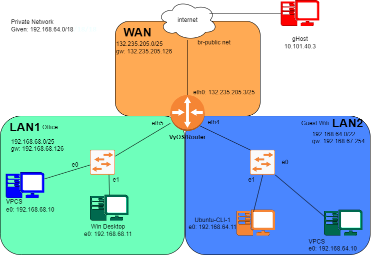
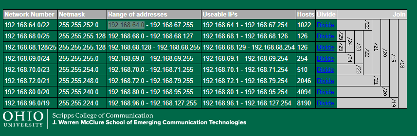

# Lab 7  

DNS LAB for ITS2300 -- Izaak Wolfgang White

## Task 1

 Name           | Interface        | Address/Mask     |
---------------|-----------------|------------------|
 WAN Network | br-PublicNet | 132.235.205.0/25 |
 Internal Networks | | 192.168.64.0/18 |

## IP Grid

 Name           | Interface     | Address/Mask     |
----------------|---------------|------------------|
 **WAN** | eth0 | 132.235.205.0/25 |
 VyOS-1         | eth0 |132.235.205.3/25 |
 (WAN Gateway)  | |132.235.205.126 |
 **Guest Wi-Fi Network**       ||192.168.64.0/22|
 DHCP Pool Start        ||192.168.64.10|
 VPCS  |eth0|192.168.64.10|
 DHCP Pool Stop         ||192.168.67.250|
 VyOS-2 (Guest Wi-Fi Gateway)  |eth4|192.168.67.254|
 **Front Office Network** ||192.168.68.0/25|
 DHCP Pool Start        ||192.168.68.10|
 VPCS                   |eth0|192.168.68.10|
 DHCP Pool Stop         ||192.168.68.110|
 VyOS-1 (Front Office Gateway)  |eth5|192.168.68.126|




## Task 2 - Recipe

```bash
config
set interfaces ethernet eth0 address 132.235.205.3/25
set interfaces ethernet eth0 description WAN
set protocols static route 0.0.0.0/0 next-hop 132.235.205.126
set system name-server 132.235.9.75
set system name-server 132.235.200.41

set interfaces ethernet eth4 address 192.168.67.254/22
set interfaces ethernet eth4 description "Guest Wi-Fi Gateway"
set service dhcp-server shared-network-name GUEST_WIFI_POOL subnet 192.168.64.0/22 range 0 start 192.168.64.10
set service dhcp-server shared-network-name GUEST_WIFI_POOL subnet 192.168.64.0/22 range 0 stop 192.168.67.250
set service dhcp-server shared-network-name GUEST_WIFI_POOL subnet 192.168.64.0/22 default-router 192.168.67.254
set service dhcp-server shared-network-name GUEST_WIFI_POOL subnet 192.168.64.0/22 lease 120
set service dhcp-server shared-network-name GUEST_WIFI_POOL subnet 192.168.64.0/22 name-server 132.235.9.75
set service dhcp-server shared-network-name GUEST_WIFI_POOL subnet 192.168.64.0/22 name-server 132.235.200.41

set interfaces ethernet eth5 address 192.168.68.126/25
set interfaces ethernet eth5 description "Front Office Gateway"
set service dhcp-server shared-network-name FRONT_OFFICE_POOL subnet 192.168.68.0/25 range 0 start 192.168.68.10
set service dhcp-server shared-network-name FRONT_OFFICE_POOL subnet 192.168.68.0/25 range 0 stop 192.168.68.110
set service dhcp-server shared-network-name FRONT_OFFICE_POOL subnet 192.168.68.0/25 default-router 192.168.68.126
set service dhcp-server shared-network-name FRONT_OFFICE_POOL subnet 192.168.68.0/25 lease 120
set service dhcp-server shared-network-name FRONT_OFFICE_POOL subnet 192.168.68.0/25 name-server 132.235.9.75
set service dhcp-server shared-network-name FRONT_OFFICE_POOL subnet 192.168.68.0/25 name-server 132.235.200.41

commit

```

To get DHCP confirmation for VPCS's

```bash
dhcp
show ip
ping 8.8.8.8
```

VyOS

```bash
exit
show dhcp server leases
show d
```

## Task 3  

### VyOS

```bash
set service dns forwarding name-server 132.235.9.75
set service dns forwarding name-server 132.235.200.41
set service dns forwarding allow-from 192.168.64.0/22
set service dns forwarding listen-address 192.168.67.254
set service dns forwarding name-server 132.235.9.75
set service dns forwarding name-server 132.235.200.41
set service dns forwarding allow-from 192.168.68.0/22
set service dns forwarding listen-address 192.168.68.126
```

Ubuntu GUI:

```bash
dig @192.168.67.254 www.its.ohio.edu
```

Windows :

```powershell
nslookup www.its.ohio.edu 192.168.68.126
```

## Task 4

In the Windows-Desktop IP settings, change the NIC option: Use the following DNS server addresses: to Preferred DNS Server use the same IP address that was selected network gateway for that network.

Use the nslookup command on the windows command line to test your configuration. If you are successful, you should see the IP address of gateway as the DNS server returning information from the query.

```nslookup google.com```

---

Ubuntu GUI

```bash
sudo nmcli con mod "Wired connection 1" ipv4.ignore-auto-dns yes
sudo nmcli con mod "Wired connection 1" ipv4.dns 192.168.67.254
sudo nmcli connection down "Wired connection 1"
sudo nmcli connection up "Wired connection 1"

dig www.its.ohio.edu
```

## Task 5

WireShark Between VyOS-1 and Windows-Desktop-1, then enter the Wireshark filter dns, This command should show information about the DNS query you made, and the response.

It may be necessary to sift through the Wireshark data to find the packets associated with this request and response.

Open a cmd window on your Windows machine and run the command:

```bash
nslookup ohio.edu
```

Repeat the nslookup for a new domain name (you pick).

Stop the Wireshark packet capture and identify the DNS request and response packets for the new request.

Stop the Wireshark capture. Select the DNS response packet for the query.

```bash
nslookup izaak-white.com
```

Using Wireshark export skills learned in earlier labs. Export the DNS packet found and compare nslookup output with Wireshark data to identify the Query type in the request and the TTLs in the response. You will need MORE than summary lines to get full credit. Read the question carefully for more details.

## Task 6

Using commands and options learned in class use the nslookup command to discover the NS (Name Server) records for coke.com

Using commands and options learned in class use the dig command to discover the MX (mail exchanger) records for ford.com

Windows CMD:

```powershell
nslookup -type=ns coke.com
```

Ubuntu GUI:

```bash
dig ford.com MX
```
