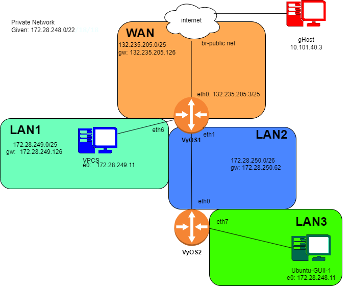

# Lab 8

Lab 8 Bash and PreLab IP and Drawing

## Ip Grid for (172.28.248.0/22)

| **Network**      | **Device/Role**           | **Interface** | **IP Address**                  |
|------------------|---------------------------|---------------|----------------------------------|
| **WAN**          |                           |               |                                  |
|                  | VyOS-1 (WAN Gateway)      | eth0          | 132.235.205.126/25               |
|                  |                           |               |                                  |
| **LAN1 Network** | 172.28.249.0/25           |            ||
|                  | DHCP Pool Start           |               | 172.28.249.11                    |
|                  | Client Address            |               | 172.28.249.12 - 172.28.249.121   |
|                  | DHCP Pool Stop            |               | 172.28.249.121                   |
|                  | VyOS-1 (LAN1 Gateway)     | eth6          | 172.28.249.126                   |
|                  |                           |               |                                  |
| **LAN2 Network** | 172.28.250.0/26           |               |                                  |
|                  | VyOS-2 (LAN2 Client)      | eth0          | 172.28.250.1                     |
|                  | VyOS-1 (LAN2 Gateway)     | eth1          | 172.28.250.62                    |
|                  |                           |               |                                  |
| **LAN3 Network** | 172.28.248.0/24           |               |                                  |
|                  | DHCP Pool Start           |               | 172.28.248.11                    |
|                  | Client Address            |               | 172.28.248.12 - 172.28.248.249   |
|                  | DHCP Pool Stop            |               | 172.28.248.249                   |
|                  | VyOS-2 (LAN3 Gateway)     | eth7          | 172.28.248.254                   |
|                  |                           |               |                                  |
| **LAN4 Network** | 172.28.249.128/25         |               |                                  |
|                  | DHCP Pool Start           |               | 172.28.249.139                   |
|                  | Client Address            |               | 172.28.249.140 - 172.28.249.249  |
|                  | DHCP Pool Stop            |               | 172.28.249.249                   |
|                  | VyOS-2 (LAN4 Gateway)     | eth6          | 172.28.249.254                   |

## Diagram



## Task 2 Bash Code and Configuring the network

WAN to VyOS-1

```bash
config
set interfaces ethernet eth0 address 132.235.205.3/25
set interfaces ethernet eth0 description WAN
set protocols static route 0.0.0.0/0 next-hop 132.235.205.126
set system name-server 132.235.9.75
set system name-server 132.235.200.41
```

Lan 1 Config

```bash
set interfaces ethernet eth6 address 172.28.249.126/25
set interfaces ethernet eth6 description LAN1_Gateway
set service dhcp-server shared-network-name LAN1_POOL subnet 172.28.249.0/25 range 0 start 172.28.249.11
set service dhcp-server shared-network-name LAN1_POOL subnet 172.28.249.0/25 range 0 stop 172.28.249.121
set service dhcp-server shared-network-name LAN1_POOL subnet 172.28.249.0/25 default-router 172.28.249.126
set service dhcp-server shared-network-name LAN1_POOL subnet 172.28.249.0/25 lease 120
set service dhcp-server shared-network-name LAN1_POOL subnet 172.28.249.0/25 name-server 132.235.9.75
set service dhcp-server shared-network-name LAN1_POOL subnet 172.28.249.0/25 name-server 132.235.200.41
```

Lan 2 Config

```bash
set interfaces ethernet eth1 address 172.28.250.62/26
set interfaces ethernet eth1 description LAN2_Gateway
```

Nat

```bash
set nat source rule 100 outbound-interface eth0
set nat source rule 100 source address 172.28.248.0/22
set nat source rule 100 translation address masquerade
```

Commit

```bash
commit
```

VyOS 2 - LAN 3 Block, LAN 4 Block, Nat 3, Nat 4

```bash
set interfaces ethernet eth7 address 172.28.248.254/24
set interfaces ethernet eth7 description LAN3_Gateway
set service dhcp-server shared-network-name LAN3_POOL subnet 172.28.248.0/24 range 0 start 172.28.248.11
set service dhcp-server shared-network-name LAN3_POOL subnet 172.28.248.0/24 range 0 stop 172.28.248.180
set service dhcp-server shared-network-name LAN3_POOL subnet 172.28.248.0/24 default-router 172.28.248.254
set service dhcp-server shared-network-name LAN3_POOL subnet 172.28.248.0/24 lease 120
set service dhcp-server shared-network-name LAN3_POOL subnet 172.28.248.0/24 name-server 132.235.9.75
set service dhcp-server shared-network-name LAN3_POOL subnet 172.28.248.0/24 name-server 132.235.200.41

set interfaces ethernet eth6 address 172.28.249.254/25
set interfaces ethernet eth6 description LAN4_Gateway
set service dhcp-server shared-network-name LAN4_POOL subnet 172.28.249.128/25 range 0 start 172.28.249.139
set service dhcp-server shared-network-name LAN4_POOL subnet 172.28.249.128/25 range 0 stop 172.28.249.249
set service dhcp-server shared-network-name LAN4_POOL subnet 172.28.249.128/25 default-router 172.28.249.254
set service dhcp-server shared-network-name LAN4_POOL subnet 172.28.249.128/25 lease 120
set service dhcp-server shared-network-name LAN4_POOL subnet 172.28.249.128/25 name-server 132.235.9.75
set service dhcp-server shared-network-name LAN4_POOL subnet 172.28.249.128/25 name-server 132.235.200.41

commit
```

Route Table

```bash
run show ip route
```

Static Config

VyOs-1

```bash
set protocols static route 172.28.248.0/24 next-hop 172.28.250.1
```

VyOs-2

```bash
set protocols static route 0.0.0.0/0 next-hop 172.28.250.62
```
